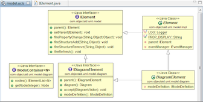

#Eclipse Configuration Reference Guide
This guide describes how to properly install and configure Eclipse for Java development. While replicating an Eclipse installation is relatively easy (as easy as copying the Eclipse installation directory to another machine), **replicating the configurations** by all members of a development team is not a simple task. This text aims at documenting a reference Eclipse configuration that can be shared and replicated within a team of programmers. 

##Step-by-step installation
Setup the Eclipse Integrated Development Environment

* [Eclipse Setup](#eclipse_setup)

Setup the SVN version control and Google Toolkit plugins

* [Eclipse SVN plugin](#svn)
* [Eclipse Google plugin](#gpe)

Setup of fundamental code quality plugins

* [Eclipse CheckStyle plugin](#checkstyle)
* [Eclipse FindBugs plugin](#findbugs)

Setup of additional productivity plugins

* [Eclipse JAutodoc plugin](#jautodoc)
* [Eclipse ObjectAid UML plugin](#objectaid)
* [Eclipse JadClipse plugin](#jadclipse)
* [Eclipse JavaCC plugin](#javacc)

Manually configure the Code Convention plugins 

* [Creating a Checkstyle Configuration File](#checkstyle_conf_file)
* [Manually Configuring the Code Formater](#code_formatter_manually)

##Configuration files
This guide is accompanied by the **configuration files** for Eclipse and for some of the recommended plugins. These files **are meant to be synchronized** with the detailed configuration descriptions herein. In particular:

* The file [*eclipse-java-formater-config.xml*](./) should reflect the detailed configuration descriptions found in the [detailed configuration of the Code Formater](#code_formatter_manually).

* The files [*eclipse-checkstyle-config-src.xml*](./) and [*eclipse-checkstyle-config-src.xml*](./) should reflect the [detailed configurations of the Checkstyle](#checkstyle_conf_file) plugin.

Thus, any changes to the description of the configurations described in this guide must be reflected on the configuration files and, conversely, changes to the configuration files should be reflected on the guide.

## Authors
* [Paulo Carreira](http://web.ist.utl.pt/paulo.carreira)
* João Pereira
* Gonçalo Almeida

___

#Eclipse Setup
  
The Eclipse Platform is our chosen building integrated development environments (IDE). It is a versatile platform to create applications as diverse as web sites, embedded Java programs, C/C++ programs, etc. For more information check wikipedia’s page and [eclipse’s official site](http://www.eclipse.org/).

##Dependencies
You must start by installing a Java Virtual Machine (JVM) to run Java programs and also the Java Development Kit that brings the java compiler as well as other tools required to develop Java programs. It is recommended that you set up **Oracle JDK (v1.7.0_51)** that will provide  the JDK along with the JVM.

* Download and install **Oracle JDK JDK (v1.7.0_51)** from the [official site](http://www.oracle.com/technetwork/java/javase/downloads/jdk7-downloads-1880260.html)
* Set the `JAVA_HOME` environment variable 
* Add `JAVA_HOME/bin` to the `PATH` environment variable

##Download
There are a few versions of the Eclipse IDE, each equipped with a different set of plugins. You should download the **Eclipse IDE for Java EE Development** from [Eclipse download site](http://www.eclipse.org/downloads/index.php). 

**Warning:** The version of Eclipse must be compatible with JVM you installed the 32-bit JDK you must install the 32 bit Eclipse version. Likewise, if you installed the 64-bit JDK, you must install the 64-bit Eclipse.

##Installation
Define the the `$ECLIPSE_HOME` system variable to point to to the Eclipse installation directory. Make sure also that you have the and `$HOME` variable pointing to your home directory.

1. Unpack the contents of the zip file into the `$ECLIPSE_HOME` directory
2. Check that `$ECLIPSE_HOME` has the subdirectories `plugins`, `features` and `configuration`. Make sure **you don’t end up with ** a `$ECLIPSE/eclipse` directory. 
3. Create a shortcut (if needed) to the `$ECLIPSE_HOME/eclipse.exe` file and place it anywhere you find useful
4. Run Eclipse (either by running `$ECLIPSE_HOME/eclipse.exe` or double-clicking the shortcut created above)
5. Set the Workspace directory: When prompted for the workspace directory enter the value of `$HOME/workspace`.

For additional details you may refer to the [official Eclipse installation instructions](http://wiki.eclipse.org/Eclipse/Installation).

##Configuring Eclipse
Your Eclipse installation must be properly configured to help you avoid programming mistakes and improve your productivity. Check that:

* [The Java Background Compiler appropriately configured](#eclipse_setup-background_compiler)
* [The Code Formater is using the code formatting standard file](#eclipse_setup-code_formatter)
* [The Javadoc Checker is enabled](#eclipse_setup-javadoc_checker)
* [The source code of the JDK is installed](#eclipse_setup-attach_source)

###Configure the Background Compiler
Eclipse provides an incremental compiler that runs in background (check **Project → Build automatically**). Some compiler’s checks are useful for detecting potential coding problems and should be enabled.

1. Go to **Window → Preferences**
2. On the left list select **Java → Compiler**
3. Open **Errors/Warnings**
4. Expand **Code Style**
5. Set **Undocumented empty block** to **Warning**
6. Expand **Potential coding problems**
7. Set **Possible accidental boolean assignment** to **Warning**
8. Set **Enum type constant not covered by switch** to **Warning**
9. Press **OK**. You might receive a message saying that Eclipse needs to rebuild, just press **Yes**.

###Configure the Code Formatter
The code formatter is an Eclipse component that formats (or indents) the code automatically when **CTRL+SHIFT+F** is pressed.

Using the same code for mating convention is **essential to achieve code readability** and avoid unnecessary conflicts when using version control. It also helps to frame developer ego---subsuming individual programmers stylistic preferences to the standard used by the group--- resulting in higher maintainability and faster code reviews. 

The following instructions show how to import a file with the set of necessary configurations. 

1. Go to **Window → Preferences**
2. Open **Java → Code style → Formatter**
3. Click **Import** and use the [*eclipse-java-formater-config.xml*](./) file in the same directory as this instructions

Alternatively, you may also configure manually the Code formater by following the instructions about [Manually Configuring the Code Formatter](#code_formatter_manually).

The formater is configured to follow the coding conventions of [SUNs/Oracle Java Coding Formatting](http://www.oracle.com/technetwork/java/codeconventions-150003.pdf) conventions and the infamous book [Elements of Java Style](http://www.cambridge.org/us/academic/subjects/computer-science/software-engineering-and-development/elements-java-style) book with minor adjustments. 

Some adjustments to the original configuration are needed so that the code, after being formatted, is not rejected by the [Checkstyle plugin](#checkstyle).

###Enable the Javadoc Checker
It is important that your [Javadoc comments](http://en.wikipedia.org/wiki/Javadoc) are well written otherwise you’ll probably end up with errors when you generate the javadoc.

To configure Eclipse to warn about malformed Javadoc comments, proceed as follows:

1. Go to **Window → Preferences**
2. Open **Java → Compiler → Javadoc**
3. Check the **Process Javadoc Comments** option
4. On **Malformed Javadoc Comments** set the warning type to **Warning**

Please consider reading Oracle's [How to write Javadoc comments for the Javadoc tool](http://www.oracle.com/technetwork/java/javase/documentation/index-137868.html) manual. If you are designing an API, please read also the [Java API documentation requirements](http://www.oracle.com/technetwork/java/javase/documentation/index-142372.html).

###Attach the Source Code of JDK
1Sometimes the documentation of the Java API is not comprehensive enough forcing you to look at the actual code of the library. We can actually learn a lot by looking at the Java library code. If you want to seamlessly jump to an API item as an hyperlink you should have the source code of the JDK attached to your JDK installation on Eclipse.

1. Go to **Window → Preferences**
2. Open **Java → Installed JRE**
3. Click on the appropriate JRE (e.g. jre6) and press **Edit…**
4. Select all items in the **System Libraries** list
5. Click on **Source Attachment…**
6. Click on **External File…**
7. Locate the *src.zip* file on your JDK
8. Press **OK** and then press **Finish**
9. To test the configuration, create a simple java file like:
	
        public class Teste {
				void testme() {
					System.out.println();
				}
			}
	
10. Press **CTRL** and click on `System` class identifier. An editor window should open with the code of `the java.lang.System.`

##Install Additional Productivity Eclipse Plugins
Your Eclipse installation comprises a number of plugins. However some plugins that are important for your productivity are not part of the base installation. For maximum productivity consider installing also the following plugins.

**Essential Productivity Plugins**

* [Eclipse CheckStyle plugin](#checkstyle)
* [Eclipse FindBugs plugin](#findbugs)
* [Eclipse JAutodoc plugin](#jautodoc)

**Additional Productivity Plugins**

* [Eclipse ObjectAid UML plugin](#objectaid)
* [Eclipse JadClipse plugin](#jadclipse)
* [Eclipse JavaCC plugin](#javacc)
	
##Troubleshooting your Eclipse Installation
* Launch fails with the message `java.lang.NoClassDefFoundError: examples/MyClass. Exception in thread “main”`.
This happens because the build process is failing. This type of failure can be caused by multiple reasons, yet the most common is because no *.class* is being generated. Go to *Window → Show view → Problems* and try correct the problems listed. Sometimes the problem is just a missing dependency among projects.

* Eclipse doesn’t start and complains with Workspace is in use choose another one
This happens when Eclipse crashes. Kill the java processes of Eclipse and try again. If the problem persists, go to the *.metadata* directory within the workspace directory and delete the .lock file.

____

#Eclipse SVN Plugin Setup
Eclipse Subversive Plugin for SVN enables the integration of tools in Eclipse to use SVN visually browse repositories. It consists of two parts: the plugin itself and SVN connectors. It takes two to be able to work with SVN repositories. 

##Dependencies
* [Install Eclipse IDE](#eclipse_setup)

##Installation
1. Go to **Help → Install New Software…**
2. Click **Add…**
3. Type in the update site name: **Eclipse kepler**
4. Type in the update address [http://download.eclipse.org/releases/kepler](http://download.eclipse.org/releases/kepler ) 
5. Select packets within 'Collaboration | Subversive': 
	* Subversive Revision Graph 
	* Subversive SVN Integration for the Mylyn Project
	* Subversive SVN JDT Ignore Extensions 
	* Subversive SVN Team Provider 
6. Restart Eclipse
7. After restarting Eclipse, go to **Window → Views** and the select **SVN**
8. Select and install SVN connector 1.8.3 (Subversive SVN Connectors) 

____

# Google Eclipse Plugin (GPE) Setup
This plugin extends Eclipse functionality to allow the creation and development of applications based on Google Web Toolkit (GWT). The GWT framework is downloaded and installed by the plugin itself, being available. 

This plugin supports developers for building applications that have a graphical user interface in the browser, which will be necessary for the project. GWT compiles Java code and generates JavaScript files optimized to run autonomously in most desktop browsers and mobile devices (Android and iPhone). 

1. Go to **Help → Install New Software…**
2. Click **Add…**
3. Type in the update site name: **Google**
4. Type in the update address [https://dl.google.com/eclipse/plugin/4.3](https://dl.google.com/eclipse/plugin/4.3) 
5. Select the packages:
	* Google Plugin for Eclipse 
	* GWT Designer for GPE
	* SDKs
 
**Note**: if you are using Ubuntu you may experience an error that prevents the GWT designer usually start. Check the official documentation, (thanks to Bruno Macedo) 

Finally, also install the Google GWT plugin for browser (Chrome, Firefox, IE) [following the official](http://gwt.google.com/missing-plugin/MissingPlugin.html) instructions.

____

#Eclipse Checkstyle Plugin
   
Checkstyle is a Java style checker and duplicate code detector. It can be run as a stand alone application (for example, to be incorporated in a build process) or as an Eclipse plugin. We strongly recommend to be always active so that coding mistakes are caught early.

##Dependencies
* [Install Eclipse IDE](#eclipse_setup)
	
##Installation
1. Go to **Help → Install New Software…**
2. Click **Add…**
3. Type in the update site name: **Checkstyle**
4. Type in the update address [http://eclipse-cs.sf.net/update/](http://eclipse-cs.sf.net/update/)  
*Note: It may take a while to respond, you’ll probably see the message ‘pending…’*  
5. Check Checkstyle and press **Next**
6. Accept the license agreement and, when prompted, restart  
7. If you receive a warning telling that the software contains unsigned content, don’t worry and click **OK**.

##Configuration
By default, only a subset of the checks are enabled. Thus, Checkstyle must be properly configured to enable important checks that can be missing. Furthermore some adjustments have to be made to match the style of the Eclipse Code Formatter. 

To simplify the process just import the configuration files as explained below. Alternatively, the configuration file may be manually created following the instructions about [Creating a Checkstyle Configuration File](#checkstyle_conf_file)

###Showing the Checkstyle Views
1. In Eclipse, go to **Window → Show view → Other…**
2. Select **Checkstyle** and, holding Ctrl key, select **Checkstyle violations**, **Duplicated Code**
	
###Installing Checkstyle Configuration Files
1. Go to **Window → Preferences → Checkstyle**
2. Click **New...**  
3. In Type select **External Configuration File** and browse for the [*eclipse-checkstyle-config-src.xml*](./) and name it **Eclipse Checkstyle for Sources**  
4. Repeat steps 2 and 3 to add the [*eclipse-checkstyle-config-test.xml*](./) and name it **Eclipse Checkstyle for Tests**  

#### Enabling Checkstyle on a Java Project
1. Select a Java  project and open the project properties and select **Checkstyle**
2. Set the **Checkstyle active for this project**
3. Uncheck the **Use simple configuration option**
4. Remove any already existing checkstyle configuration from list (**Sun Checks** is probably there) and click **Add...**
5. This configuration will be applied to a specific file set. On the window that just opened, set the **File Set Name** to **Source Checks**
6. Select the "Eclipse Checkstyle for Sources" in the Check Configuration option
7. On the **Regular Expression Patterns** list click **New..** and add this regular expression: `src/.*\.java$` (assuming *src/* is your source folder)
8. Repeat the steps 9 through 11, naming the File Set Name to **Test Checks**, selecting **Eclipse Checkstyle for Tests** and adding the regular expression `test/.*\.java$`

###Run Checkstyle on Demand on a Specific File/Folder

1. In Eclipse, right-click with your mouse over the file or folder you want to scan
2. Go to **Checkstyle** and select **Check code with Checkstyle** option
3. Later you can disable Checkstyle warnings by selecting the option **Clear Checkstyle violations**
4. Checkstyle reports the violations found with a small icon at the respective lines. You can also see a detailed list of all violations at **Checkstyle Violations View**.

##Testing the installation
1. Open **Window → Preferences** and the select **Checkstyle**
2. The Checkstyle configuration panel should appear.

Test that the plugin is working:

1. Create a new Java project
2. Activate Checkstyle for the project
3. Create a new Java class
4. Create a constructor with a parameter that is not final:
        
        public class Xyz {
    		public Xyz(int i) {
        		i = 10;
    		}
 	    }  
	   
You should see a warning informing you that 10 is a magic number.

##Using Checkstyle
How to enable or disable Checkstyle from verifying the code on a given code region?
	
* Surround the code region that you need not to be checked with the special comments `//CHECKSTYLE:OFF`  and  `//CHECKSTYLE:ON`

How to quickly fix a file with many Checkstyle warnings?
This can be done step-by-step as follows:
	
1. Firstly, format the complete file according to the format that is being used. This will eliminate extra *TAB* characters and other formatting problems
2. Have the [**Eclipse Code Formatter**](#eclipse_setup-code_formatter) configured properly 
3. Press **CTRL+SHIFT+F** to format the entire file
4. Right click on the buffer and select Apply Checkstyle fixes….
5. Finally refactor the code, selecting the code you want to refactor and pressing **ALT+SHIFT+T**

___

	
#Eclipse Findbugs Plugin Setup
   
FindBugs is an open source program which looks for bugs in Java code. It uses static analysis to identify hundreds of different potential types of errors in Java programs. FindBugs operates on Java byte-code, rather than source code. The software is distributed as a stand-alone GUI application.

##Dependencies
* [Install Eclipse IDE](#eclipse_setup)

##Installation
1. Go to **Help → Install New Software…**
2. Click **Add…**
3. Type in the update site name: **FindBugs**
4. Type in the update address [http://findbugs.cs.umd.edu/eclipse/](http://findbugs.cs.umd.edu/eclipse/) *(Note: may take a while…)*
5. Check FindBugs and press **Next**
6. Accept the license agreement and, when prompted, restart
7. If you receive a warning telling that the software contains unsigned content, don’t worry and click **OK**.

##Configuration
1. In Eclipse, go to **Window → Show view → Other…**
2. Select **Findbugs → Bug explorer**

**Activate FindBugs for a project:**

1. In Eclipse, right-click with your mouse over the project’s root folder and select **Properties**
2. Go to **Findbugs** and check **Run automatically**

You can **enable project specific settings** by checking the respective option.

**Run FindBugs on demand on a specific file/folder:**  
1. In Eclipse, right-click with your mouse over the file or folder you want to scan  
2. Go to **Find Bugs → Find Bugs**

FindBugs reports the errors found with a small icon at the respective lines. You can also see a list of all the errors at FindBugs’ view.

##Testing the installation
1. Create a new Java project
2. Activate FindBugs for the project
3. Create a new Java class named **Test**
        
        public class Test {
			Integer test;

   			public Test(int i) {
       			test = new Integer(i);
    	   }
	   }
4. Save

You should see a warning of FindBugs informing you that the parameter new Integer(i) is an inefficient way of creating an Integer Object.

___

#Eclipse JAutodoc Plugin
  
JAutodoc is a plugin that creates Javadoc comments automatically based on templates. The advantage of using this plugin is that it cuts a great deal of the time needed for creating Javadoc comments. Apart from adding the template for Javadoc style comments for the class/method and attributes it is smart enough to add the description also based on the signatures.

Please note that JAutodoc should not be used to create comment stubs quickly and not to be used to create meaningless comments. Whatever comments JAutoDoc generates must be reviewed by the programmer.

##Dependencies
* [Install Eclipse IDE](#eclipse_setup)

##Installation
1. Go to **Help → Install New Software…**
2. Click **Add…**
3. Type in the update site name: **JAutodoc**
4. Type in the update address [http://jautodoc.sourceforge.net/update/](http://jautodoc.sourceforge.net/update/) *Note: It may take a while to respond, you’ll probably see the message ‘pending…’*
5. Accept the license agreement and say **‘Yes‘** when prompted restart
6. If you receive a warning telling that the software contains unsigned content, don’t worry and click **OK**

##Configuration
1. Go to **Window → Preferences → Java → JAutodoc**
2. Uncheck the **Single line comments** option

##Using JAutodoc
###Auto-generate Javadoc for an entire file:
1. Right-click over the java file you want the javadoc to be generated
2. Go to JAutodoc and select Add Javadoc

###Auto-generate Javadoc for a specific method:
1. Select any line of the method you want the javadoc to be generated
2. Press **CTRL+ALT+J** or right-click the line, go to JAutodoc and select Add Javadoc

##See also
* JAutodoc plugin’s [home page](http://jautodoc.sourceforge.net/)

___

#Eclipse ObjectAid Plugin Setup
 

ObjectAid is a simple and diagram editor plugin for Eclipse.This plugin has some important features, such as, diagrams are saved in text format and thus can be added to a version repository and are kept coherent with the code automatically.

##Dependencies
* [Install Eclipse IDE](#eclipse_setup)
	
##Installation
1. Open **Help → Install New Software…**
2. Add the ObjectAid update site [http://www.objectaid.net/update](http://www.objectaid.net/update)
3. Install the plugin and restart Eclipse
	
##Configuration
1. Open **Window → Preferences → ObjectAid Class Diagram**
2. On **Classifiers**, leave only the **Show Icons** option checked
3. On **Relationships**, leave **Add Generalizations**, **Add Associations**, **Show Association Multiplicity**, **Show Association Labels** options checked, all remaining options should be unchecked
4. On **Attributes** uncheck all options and click **Apply**
	
##Testing the installation
1. On a Java project in Eclipse, go to **File → New → Other…**
2. Under **ObjectAid UML Diagram…**, select **Class Diagram**
3. Enter the name of the diagram
4. Drag some classes into the class editor canvas
5. You should see the classes rendered in UML notation.

##Troubleshooting
Deleted associations reappear when a project is reloaded. This happens because the project was created with the Always add associations option checked. Recreate the project with this option unchecked.

___

#JADclipse Plugin Setup
  
JAD is the best Java Decompiler available. This plugin integrates it into Eclipse. Then, when we follow a link of class that is in a .jar or .class file and the source is not available is decompiles the class and shows the code automatically.

Having this feature is very important for debugging and code understanding.

##Dependencies
* [Eclipse Setup](#eclipse_setup)
	
##Installation
1. Go to **Help → Install New Software… → Click Add…**
2. Add the JADClipse plugin update site [http://jadclipse.sourceforge.net/update/](http://jadclipse.sourceforge.net/update/)
3. Accept the license agreement and restart Eclipse when prompted

##Configuration
1. Open **Window → Preferences → Java → JadClipse**
2. Set **Path to decompiler** to the value to the jad executable, e.g., `$PROGFILES/jad/jad`
3. Set the directory for temporary files to `$CACHE/jadclipse`
4. Select **Formatting**
5. Check the **Output fields before methods** option
6. Check the **Print default initializers for fields** option
7. Check the **Output space between keyword and expression** option
8. Click **Apply**

##Testing the installation
Open a *.class* file of some jar that is included in your project and the source should appear automatically in the editor window.

___

#Eclipse JavaCC Plugin Setup
Do you need to write parsers for markup documents that do not subscribe to standard formats such as HTML or XML? JavaCC allows you to do all of that in Java. JavaCC plugin integrates it into Eclipse with grammar syntax highlight and auto-completion and on-the-fly error checking. It re-generates the Java file automatically when the grammar file is altered and saved.

##Dependencies
* [Install Eclipse IDE](#eclipse_setup)

##Installation
1. Go to **Help → Install New Software… → Click Add…**
2. Type in the update site name: **JavaCC Plugin**
3. Type in the update address: [http://eclipse-javacc.sourceforge.net/](http://eclipse-javacc.sourceforge.net/)
4. Accept the license agreement and restart Eclipse when prompted

##Testing the installation
1. Open **Window → Preferences → JavaCC**
2. The **Color** options panel should appear

##See also
Official JavaCC for Eclipse [home page](http://eclipse-javacc.sourceforge.net/)

___

#Checkstyle Manual Configuration
The following set of instructions will guide you through the process of creating a checkstyle configuration that works well with FindBugs plugin and with the Eclipse Code Formater itself. 

The settings below are the result of much research, discussion with other programmers and trial and error. Consider them as best practices. 

**Adjusting the Checkstyle plugin settings**

1. Go to **Window → Preferences** and select **Checkstyle** on left menu list
2. Select Sun Checks and press Copy…
3. Enter the name **Eclipse Source Checks** and press Ok
4. Select **Eclipse Source Checks** and press **Configure…**
5. Open module **Regexp** and disable **RegExpSingleLine** expression that check for lines with trailing spaces
6. Open module **Whitespace** and disable **Do whitespace before** and **Typecast Parent Pad** options
7. Open module **Blocks** and, **On Left Curly Brace placement**, set the option to **EOL**
8. Disable **Avoid nested blocks**
9. Open module **Size Violations** and enable **Anonymous inner class lengths**. For that, press **Add…** You should see a new window with the module name **Anonymous inner class lengths**. If not, press **Cancel** until it does. Set max to 75 and press **OK**. Press **Cancel** for the next modules’ windows
10. Disable **Maximum Line Length**
11. Open module **Coding problems** and enable the following coding problems (besides those already enabled). To do so, press **Add…** and for each module press **OK** to enable it or **Cancel** to disable it
12. Enable **Covariant Equals**
13. Enable **Default Comes Last**
14. Enable **Declaration Order Check**
15. Enable **Explicit initialization**
16. Enable **Fall through**
17. Enable **Final Local variable**
18. Enable **Illegal Catch**
19. Enable **Illegal throws**
20. Enable **JUnit test case**
21. Enable **Missing constructor**
22. Enable **Modified Control Variable**
23. Enable **Multiple Variable Declaration**
24. Enable **Nested if Depth** and set max to 3
25. Enable **Nested try Depth** and set max to 2
26. Enable **No Clone**  
*Note: Java clone() is mostly broken. We should resort copy constructors as endorsed by Joshua Bloch.*
27. Enable **Package Declaration**
28. Enable **Parameter Assignment**
29. Enable **Return Count** and set max 3
30. Enable **String Literals Equality**
31. Enable **Super Clone**
32. Enable **Super Finalize**
33. Disable **Trailing Array Coma**
34. Disable **Multiple String Literals**
35. As a principle, recurring strings should be declared as constants. However, there are cases where this doesn't make sense, like this:

        return x + ", " + y + ", "+ z;
Unfortunately Checkstyle has no way to distinguish between short and long strings and complains that the string `" ,"` is used multiple times.

36. Disable **Return count**
While it is true that many return points can be indication that code is attempting to do too much or may be difficult to understand. Most methods with this problem are small (<10 lines). Since we cannot disable checking this rule on small methods we disable it. Lengthy methods will be indicated by another rule.

37. Find and double-click **Illegal throws** and delete the **java.lang.Throwable** class name from the list. Otherwise, perfectly good code like overriding finalize will be marked with an error :

        @Override
	    protected void finalize() throws Throwable {
	        super.finalize();
	        this.close();
			}
	
38. Find and double-click **Redundant Throws**
39. Enable **allowUnchecked** and **allowSubClasses**
40. Open module **Miscellaneous**
41. Disable **Final Parameters**  
***Rationale:*** *Final parameters are a means to prevent assignments to parameters, since this is a very poor programming practice. However, enabling the Parameter Assignment check on the Coding Problems section performs this check without forcing the programmer clutter the code and write the final keyword for every parameter.*
42. Open module **Duplicates** and enable **Strict duplicate code** using the **Add…** button
43. Open module **Class design**, select **Visibility Modifier** and enable **Protected allowed**
44. Select **Design for Extension** and set the severity to **Info**. To be more precise only the classes that implement the decorator pattern should have this setting.
45. Open module **Javadoc Comments**, select **Method JavaDoc** and check **allowUndeclaredRTE** and **allowThowsTagsForSubclasses**
46. Select the module **Filters**
47. Enable **Suppression Comment Filter**  
***Rationale:*** *In some situations it may be legitimate to create a block of code that is not means to be checked. This should a rare exception that will have to be documented appropriately.*

**Re-exporting the configuration file**

Select the newly created configuration, press **Export...** at the bottom right corner and save the file in a suitable folder.

___

#Eclipse Code Formatter Manual Configuration
The following instructions will guide you through the process of manually configuring the **Code Formater** options in Eclipse.

**Adjusting the Eclipse Code Fromater settings**

1. Go to **Window → Preferences**
2. Expand **Java → Code style → Code formatter**
3. Choose **Java Conventions** and click **Edit…**
4. On the **Indentation** tab, set the tab policy to **Tabs Only**  
5. On the **Blank Lines** tab set the number of blank lines to preserve to 10  
***Rationale:*** *More that 10 blank lines will be automatically compacted*
6. On the **New Lines** tab: Enable at end of file
7. On the **Line Wrapping** tab, set the maximum line with to 100  
***Rationale:*** *There is a lot of debate on this question but 80 columns is considered the standard for comfortably fitting printed text. We allow 100 because it is also possible to print in 132 columns. If our code needs to go beyond that limit that is a good indicator that the code is needing refactoring. Using more than that makes the code more difficult to follow and to print for people with smaller screens.*
8. Select **Class Declarations**:
	* Set **Line Wrapping Policy** to **Wrap only when necessary**
	* Check **Force Split** for both **Extends** and **Implements** clauses
9. Expand **Function Calls** and select **Arguments**
10. On **Indentation Policy**, select **Indent on Column**
11. On the **Comments tab → General Settings**:
	* Disable **Block Comments**
	* Enable **Header Comment Formatting**
12. On the **Comments** tab → **Javadoc Settings**:
	* Enable **Remove blank lines in comments**  
***Rationale:*** *Extra blank lines are not needed. Javadoc comment blanks lines, if needed, should be introduced using HTML (e.g using   tag).*
13. Disable **New line after @param tags** and click **Ok**  
***Rationale:*** *This makes comment blocks more compact, following SUN’s standard.*

**Re-exporting the Configuration file**

You may export the configuration file clicking in **Export All...** and saving the file to a suitable folder
